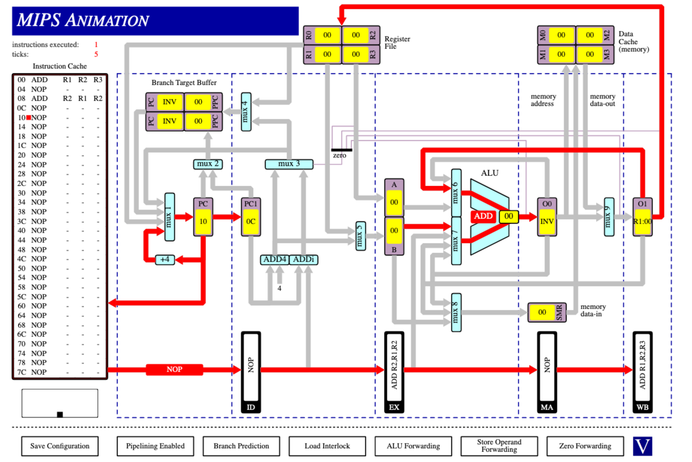
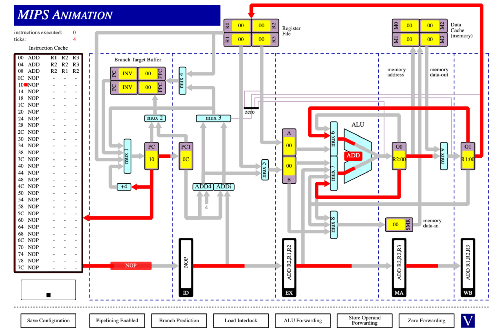
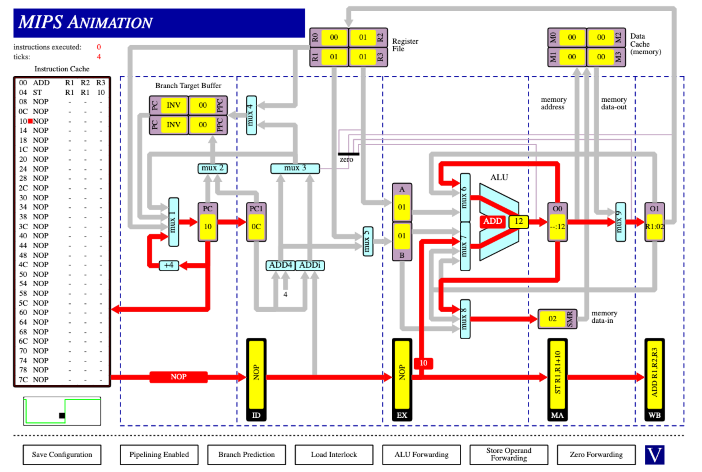
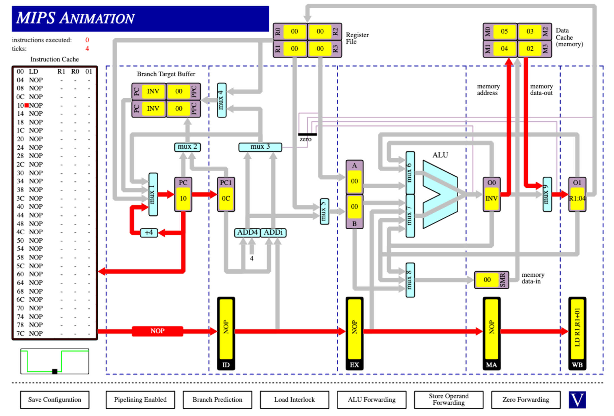
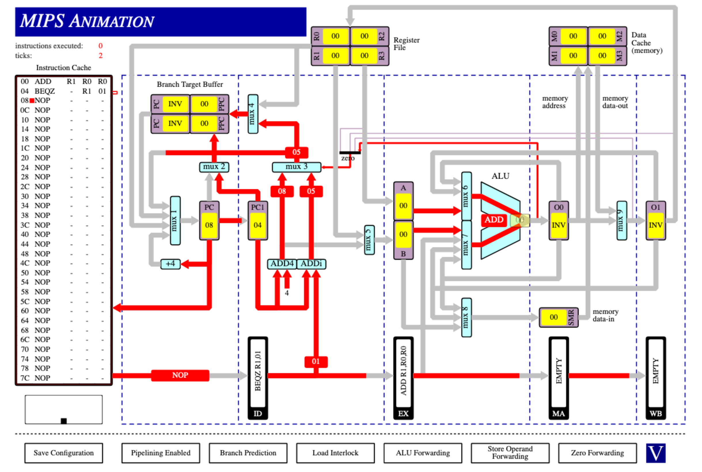
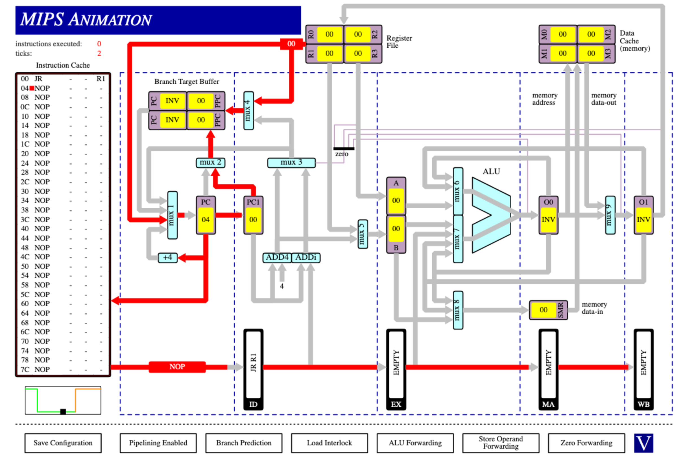
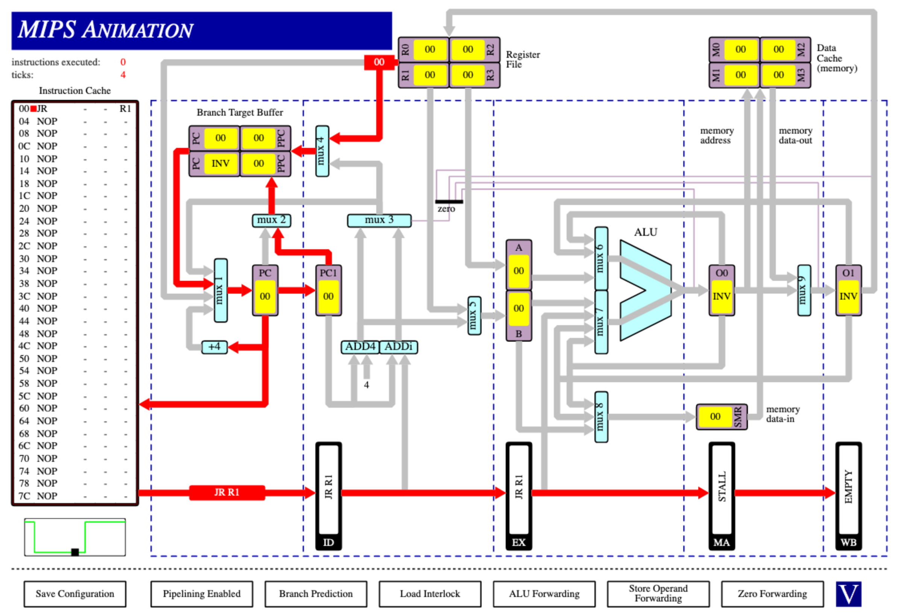

***Q1***  
1.)  
```
ADD R1 R2 R3
NOP -  -  -
ADD R2 R1 R2
```

2.) 
```
ADD R1 R2 R3
ADD R2 R2 R3
ADD R2 R1 R2
```

3.) 
```
ADD R1 R2 R3
ST  R1 R1 10
```

4.) 
```
ADD R1 R2 R3
ST  R1 R1 10
```

5.) 
```
LD R1 R0 01
```

6.) 
```
ADD  R1 R0 R0
BEQZ -  R1 01
```

7.) 
```
JR - - R1
```

8.) 
```
JR - - R1
```
<br/>

***Q2***  
(i) 
cycles = 10 &nbsp;&nbsp;&nbsp;&nbsp; R1 = 0x15  
The CPU can read values from the buffer O0 (and O1) and use that in the next instruction without waiting for the writeback to complete.  
This also means the pipeline doesn't have to be stalled at any stage.  

(ii)
cycles = 18 &nbsp;&nbsp;&nbsp;&nbsp; R1 = 0x15   
The CPU cannot read values from any buffer registers as they don't exist and is forced to wait for the writeback operations to complete. This causes an increase in cycles as the pipeline must be stalled to keep data integrity (thanks to the ALU Interlock).  

(iii)
cycles = 10 &nbsp;&nbsp;&nbsp;&nbsp; R1 = 0x06  
The CPU cannot read values from buffer registers as they don't exist but also does not need to wait for writeback operations to complete as the ALU Interlock is disabled. This means there are no pipeline stalls but the value in R1 is not correct as arithmetic operations were performed without waiting for the results from previous operations to be written back.

<br/><br/>

***Q3***  
(i)
instructions = 38 &nbsp;&nbsp;&nbsp;&nbsp; cycles = 50  
There are 12 more cycles than instructions (in the order they occur):  
3 cycles can be accounted for due to the 4 stage pipeline. 1 instruction will take 4 cycles to complete and therefore there will always be an additional 3 cycles.
1 cycle is lost to a pipeline stall when the first load instruction is executed (`LD R2 R0 00` followed by `SRLi R2 R3 01`). Due to the data dependency (R2) of the second instruction (SRLi) on the Load instruction and the 2 cycle requirement of the Load instruction